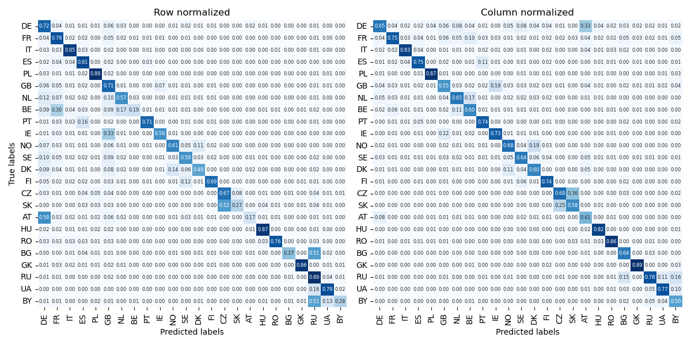

# Nationality prediction

While several tools for this task are available online, they often come with limitations that hinder their usability. For example, *nationalize.io* imposes restrictions on free access, *NamePrism* requires an approval process for API tokens, and *name2nat*, despite being open-source, is outdated and difficult to configure due to unclear dependencies.

This project takes a **machine learning approach** to nationality prediction, providing an alternative solution to address these challenges. Unlike database search-based solutions, machine learning models excel at generalization. They are capable of making predictions even for unseen names by learning patterns and features from training data.

Key advantages of this project include:
* Offline functionality: The model operates locally without the need for an internet connection
* Ease of use: A clear and straightforward setup ensures accessibility for developers
* Open and unrestricted: Free from subscription fees or usage caps

## Usage

#### Single Name Prediction

```python
from natpred import NationalityPrediction

# Initialize the predictor
nat_pred = NationalityPrediction()

# Predict the nationality for a single name
prediction = nat_pred.predict('Antonino Pizzolato', k=5)

# Display the results
print(prediction)
```

Output:
```
{'IT': 0.9919720888137817,
 'AT': 0.004203251097351313,
 'ES': 0.0007780595915392041,
 'HU': 0.0004789325757883489,
 'RU': 0.0004524968971963972,
 'FR': 0.00042069185292348266,
 'BE': 0.0003427563642617315}
```

#### Batch Prediction for Multiple Names
```python
# Predict nationalities for a list of names
names = ['Antonino Pizzolato', 'Johann Müller', 'Sofia Rossi', 'Katarzyna Nowak']
predictions = {name: nat_pred.predict(name, k=3) for name in names}

# Display the results
for name, prediction in predictions.items():
    print(f"\nTop predictions for '{name}':")
    for country, score in prediction.items():
        print(f"{country}: {score:.4f}")
```

Output:
```
Top predictions for 'Antonino Pizzolato':
IT: 0.9920
AT: 0.0042
ES: 0.0008

Top predictions for 'Johann Müller':
DE: 0.7980
AT: 0.1546
HU: 0.0188

Top predictions for 'Sofia Rossi':
IT: 0.4590
FR: 0.1478
SE: 0.1379

Top predictions for 'Katarzyna Nowak':
PL: 0.9845
RU: 0.0096
UA: 0.0034
```

## Details

### Dataset and Training
To download the dataset, simply run:
```bash
python data_downloader.py  
```

To train the model using the downloaded dataset, use the following command:
```bash
python training.py 
```

### Data

Finding a reliable dataset for nationality prediction posed significant challenges due to the scarcity of publicly available resources. Most existing datasets rely on artificially generated data, which can struggle to capture the nuances of real-world examples. To address this, the dataset for this project was built **entirely from scratch** using Wikipedia.

#### Methodology
The dataset was generated using **Wikipedia's API**, ensuring accurate and relevant data extraction. Categories explicitly tied to nationalities were targeted, such as [https://en.wikipedia.org/wiki/Category:21st-century_English_people]. This approach guarantees that the dataset is both representative and rooted in authentic, real-world information.

Key steps in the data collection process included:

* Identifying nationality-specific Wikipedia categories for people.
* Extracting names, nationalities, and related metadata.
* Eliminating ambiguous or irrelevant entries.
* By using this approach, the dataset captures realistic patterns and avoids biases introduced by synthetic or incomplete data sources.


#### Supported Countries

Currently, the model supports the following European countries:
Austria (AT), Belarus (BY), Belgium (BE), Bulgaria (BG), Czech Republic (CZ), Denmark (DK), Finland (FI), France (FR), Germany (DE), Greece (GK), Hungary (HU), Ireland (IE), Italy (IT), Netherlands (NL), Norway (NO), Poland (PL), Portugal (PT), Romania (RO), Russia (RU), Slovakia (SK), Spain (ES), Sweden (SE), Ukraine (UA), and the United Kingdom (GB).

### Model and hyperparameters

This section outlines the models, hyperparameters, and optimization strategies used in the project for nationality prediction.

#### Model Performance

Two sequence-based models were evaluated for the task: LSTM (Long Short-Term Memory) and GRU (Gated Recurrent Unit). The models' performances were assessed using key metrics: macro precision, recall, F1 score, and accuracy. The results are summarized below:

| Model \ Metric | Precision    | Recall    | F1 score | Accuracy |
| :---:   | :---: | :---: | :---: | :---: |
| LSTM | 0.682 | 0.611 | 0.631 | 69.9% |
| GRU | **0.696** | **0.629** | **0.649** | **71.5%** |

The GRU model consistently outperformed the LSTM model across all metrics, making it the preferred choice for deployment.


#### Confusion matrices
The performance of the GRU model is further illustrated using row-normalized and column-normalized confusion matrices:



#### Hyperparameter Optimization

To fine-tune the model and achieve optimal performance, hyperparameters were optimized using the [**Hyperband**](https://arxiv.org/abs/1603.06560) algorithm, a state-of-the-art method for efficient hyperparameter search. Hyperband utilizes a bandit-based approach, allocating computational resources dynamically to the most promising hyperparameter configurations, thus speeding up the optimization process. This makes Hyperband especially useful when working with limited computational resources, as was the case in this project.

The optimal model configuration includes:

* Embedding Size: 128
* GRU Layer: 3 layers, each with 512 units
* Learning Rate: 0.0003
* Dropout: 0.5 on the last hidden layer


### Comparison with Existing Tools

To evaluate the effectiveness of the proposed model, its performance was compared to nationalize.io, a widely used API for nationality prediction. Since the project currently focuses on European countries, only the European nationality with the highest probability was considered for predictions.

The following table summarizes the performance of nationalize.io on the test set, using the same evaluation metrics: macro precision, recall, F1 score, and accuracy.

| Model \ Metric | Precision    | Recall    | F1 score | Accuracy |
| :---:   | :---: | :---: | :---: | :---: |
| GRU | 0.696 | 0.629 | 0.649 | 71.5% |
| *nationalize.io* | 0.699 | 0.629 | 0.653 | 65.5% |


#### Conclusions

While the two approaches are comparable in performance, the GRU-based model provides unique advantages:

* Offline Functionality: No internet connection required.
* Free and Unrestricted: No subscription fees or API limitations.

These benefits make the GRU-based model a competitive and practical alternative for developers and researchers.


## Next steps
* **Improve codebase**: Refactor for flexibility, modularity, and maintainability.
* **Test more models**
* **Increase and expand dataset**
* **Publish on PyPI**: Make installation via pip easier
* **Evaluate performance**: Test on names from linguistically/culturally similar countries (e.g., Russia, Ukraine, Belarus).
