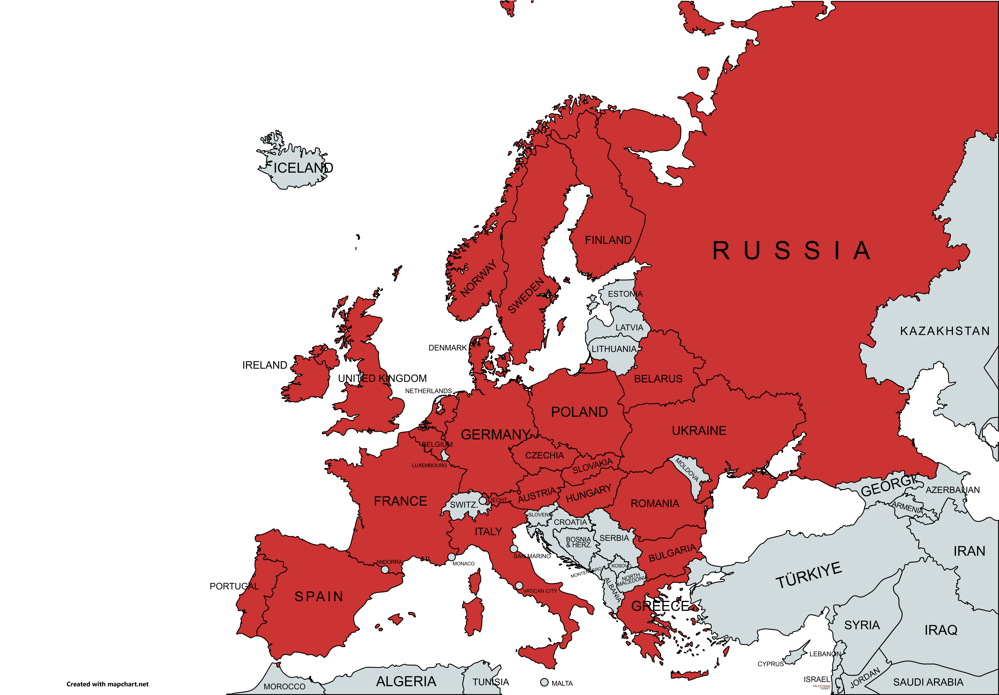
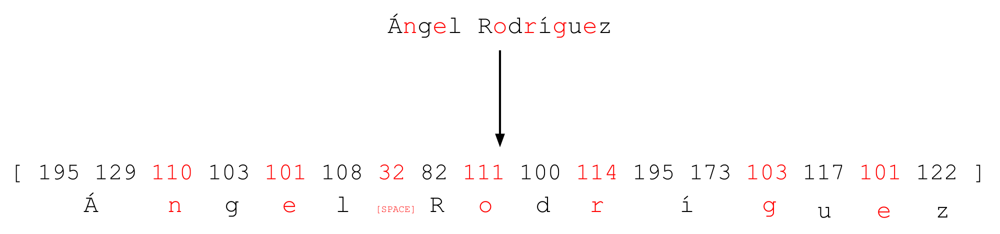
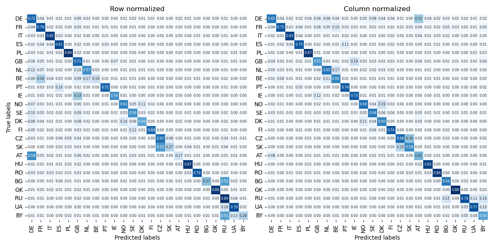

# Nationality prediction

While several tools for this task are available online, they often come with limitations that hinder their usability. For example, *nationalize.io* imposes restrictions on free access, *NamePrism* requires an approval process for API tokens, and *name2nat*, despite being open-source, is outdated and difficult to configure due to unclear dependencies.

This project takes a **machine learning approach** to nationality prediction, providing an alternative solution to address these challenges. Unlike database search-based solutions, machine learning models excel at generalization. They are capable of making predictions even for unseen names by learning patterns and features from training data.

## Table of Contents

1. [Dataset](#dataset)  
    - [Supported Countries](#supported-countries)
2. [Models](#models)
3. [Results](#results)
   - [Comparison with existing tools](#comparison-with-existing-tools)
4. [Usage](#usage)
5. [Next steps](#next-steps)

## Dataset

Finding a reliable dataset for nationality prediction posed significant challenges due to the scarcity of publicly available resources. Most existing datasets rely on artificially generated data, which can struggle to capture the nuances of real-world examples. To address this, the dataset for this project was built **entirely from scratch** using Wikipedia.

### Methodology
The dataset was generated using **Wikipedia's API**, ensuring accurate and relevant data extraction. Categories explicitly tied to nationalities were targeted, such as [https://en.wikipedia.org/wiki/Category:21st-century_English_people]. This approach guarantees that the dataset is both representative and rooted in authentic, real-world information.

Key steps in the data collection process included:

* Identifying nationality-specific Wikipedia categories for people.
* Extracting names, nationalities, and related metadata.
* Eliminating ambiguous or irrelevant entries.
* By using this approach, the dataset captures realistic patterns and avoids biases introduced by synthetic or incomplete data sources.

### Supported Countries



Currently, the model supports the following European countries:
Austria (AT), Belarus (BY), Belgium (BE), Bulgaria (BG), Czech Republic (CZ), Denmark (DK), Finland (FI), France (FR), Germany (DE), Greece (GK), Hungary (HU), Ireland (IE), Italy (IT), Netherlands (NL), Norway (NO), Poland (PL), Portugal (PT), Romania (RO), Russia (RU), Slovakia (SK), Spain (ES), Sweden (SE), Ukraine (UA), and the United Kingdom (GB).

## Models
This project explores two main architectural approaches: Recurrent Neural Networks (RNNs) and Transformers.

#### RNNs

For Recurrent Neural Networks (RNNs), names were represented as byte sequences using UTF-8
encoding, converting each name into a series of numbers ranging from 0 to 255. Byte-level
embeddings are particularly effective for name inputs because they support text in
any language without relying on a predefined vocabulary. This makes them well-suited for
handling multilingual tasks and names from diverse linguistic origins. Unlike word or subword
tokenization, byte-level representations eliminate the risk of out-of-vocabulary tokens,
ensuring that all input text is fully represented. This approach can capture subtle patterns
in spelling. Additionally, since names are typically short, their entire byte sequence can be processed
efficiently, without dividing sequence.



The following RNN architectures were explored:

- **LSTM**: Designed to address the vanishing gradient problem in standard RNNs.
- **GRU**: GRUs are a simplified alternative to LSTMs with fewer parameters, making them computationally efficient.

#### Transformers
Pretrained models, such as BERT, demonstrated significantly better performance than randomly
initialized models. For these models, the respective standard tokenizers were used to process
input data.

- **BERT**: Fine-tuning BERT yielded the best overall performance. Despite being pretrained on general text data and using subword tokenization, BERT effectively adapted to name classification, surpassing all other models.
- **mBERT**: Although mBERT is pretrained on multilingual data, it underperformed compared to BERT. This could be attributed to the broader scope of mBERT's training data, diluting its effectiveness for this specific task.

### Hyperparameters

- **RNNs**: Hyperparameter optimization was performed using the [Hyperband](https://arxiv.org/abs/1603.06560) algorithm, which efficiently balances exploration and exploitation by evaluating configurations over varying budgets, which is especially usefull when training models on a PC.
- **Transformers**: For Transformers, a straightforward grid search was employed.


## Results

The models' performances were evaluated using **precision**, **recall**, **F1 score** (macro-averaged), and **accuracy**. Below is a comparison of the results:

| Model \ Metric | Precision |  Recall   | F1 score  | Accuracy  |
|:--------------:|:---------:|:---------:|:---------:|:---------:|
|      LSTM      |   0.727   |   0.688   |   0.685   |   68.8%   |
|      GRU       | **0.739** |   0.705   |   0.702   |   70.5%   |
|   BERT-base    | **0.738** | **0.714** | **0.715** | **71.5%** |
|     mBERT      |   0.725   |   0.694   |   0.687   |   69.4%   |

#### **Key observations**

- BERT achieves best overall performance with **0.715** F1 score and **71.5%** accuracy.
- GRU shows competitive performance despite simpler architecture and lack of pre-training.
- GRU slightly outperformed LSTM in both precision and recall, validating its effectiveness as a lightweight alternative for sequence-based tasks.


#### Confusion matrices

The performance of the GRU model is further illustrated using row-normalized and column-normalized confusion matrices:



### Comparison with existing tools

To evaluate the effectiveness of the proposed model, its performance was compared to nationalize.io, a widely used API for nationality prediction. Since the project currently focuses on European countries, only the European nationality with the highest probability was considered for predictions.

The following table summarizes the performance of nationalize.io on the test set, using the same evaluation metrics: macro precision, recall, F1 score, and accuracy.

| Model \ Metric | Precision    | Recall    | F1 score | Accuracy |
| :---:   | :---: | :---: | :---: | :---: |
| GRU | 0.739 | 0.705 | 0.702 | 70.5% |
| *nationalize.io* | 0.699 | 0.629 | 0.653 | 65.5% |


#### Conclusions

The GRU-based model outperforms nationalize.io in several key performance metrics, demonstrating its effectiveness in nationality prediction.


## Usage

#### Training

To download the dataset, simply run:
```bash
python data_downloader.py  
```

To train the model using the downloaded dataset, use the following command:
```bash
python training.py 
```

#### Single Name Prediction

```python
from natpred import NationalityPrediction

# Initialize the predictor
nat_pred = NationalityPrediction()

# Predict the nationality for a single name
prediction = nat_pred.predict('Antonino Pizzolato', k=5)

# Display the results
print(prediction)
```

Output:
```
{'IT': 0.9919720888137817,
 'AT': 0.004203251097351313,
 'ES': 0.0007780595915392041,
 'HU': 0.0004789325757883489,
 'RU': 0.0004524968971963972,
 'FR': 0.00042069185292348266,
 'BE': 0.0003427563642617315}
```

#### Batch Prediction for Multiple Names
```python
# Predict nationalities for a list of names
names = ['Antonino Pizzolato', 'Johann Müller', 'Sofia Rossi', 'Katarzyna Nowak']
predictions = {name: nat_pred.predict(name, k=3) for name in names}

# Display the results
for name, prediction in predictions.items():
    print(f"\nTop predictions for '{name}':")
    for country, score in prediction.items():
        print(f"{country}: {score:.4f}")
```

Output:
```
Top predictions for 'Antonino Pizzolato':
IT: 0.9920
AT: 0.0042
ES: 0.0008

Top predictions for 'Johann Müller':
DE: 0.7980
AT: 0.1546
HU: 0.0188

Top predictions for 'Sofia Rossi':
IT: 0.4590
FR: 0.1478
SE: 0.1379

Top predictions for 'Katarzyna Nowak':
PL: 0.9845
RU: 0.0096
UA: 0.0034
```

## Next steps
* Primary focus is to improve the quality of dataset and expanding set of predicted countries
